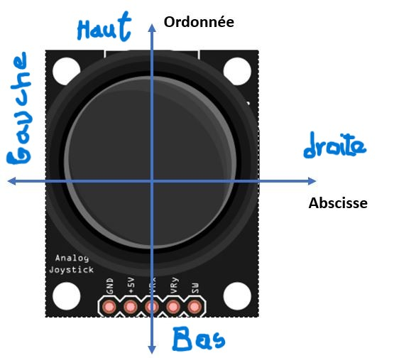
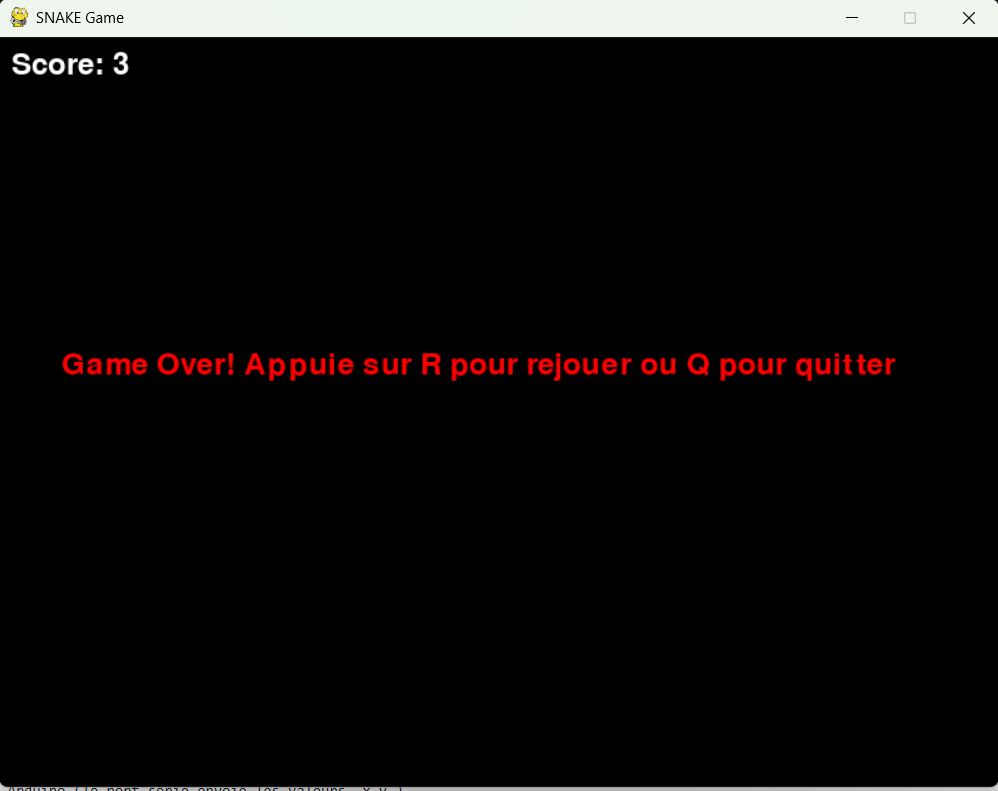

# Snake Game contrôlé par Joystick 🎮🐍

Ce projet est une version du célèbre jeu Snake, codée en Python avec Pygame, et contrôlée via un joystick Arduino (lecture analogique via port série).

## 🎮 Contrôles

- 🕹️ Joystick Arduino connecté via port série
- 🟢 Déplacement : haut, bas, gauche, droite

  
- ⌨️ Option de contrôle via les touches de direction du clavier

## 📦 Dépendances

- Python 3.11+
- Pygame 2.6.1
- NumPy  2.2.6

## 🛠️ Outils
- Un environnement de développement intégré (IDE) par ex: VSCode
- Logiciel Arduino
- Microcontrôleur Carte Arduino
- Jumpers
- Joystick analogique VRX sur A0 et VRY sur A1

## ▶️ Lancer le jeu

1. Lancer le script joystick_snake.ino dans votre logiciel Arduino (le port série envoie les valeurs `x,y`)
2. Lancer `snake2.py` avec Python
   ```bash
   python snake2.py
3. Vérifier et renseigner dans le code python le port sur lequel est connecté la carte arduino à votre PC


## ▶️ Démonstration

## 🎥 Vidéo de démonstration

[](https://drive.google.com/file/d/1eXF_RE5bes0696pLvoCe-vqB3xVPHVG_/view?usp=drive_link)
